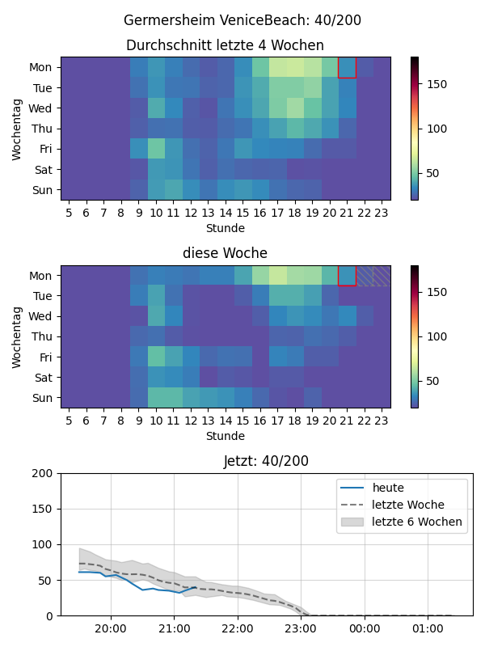

# VeniceBeach Fitness Telegram Bot

Is it a good time for a workout? Telegram bot to check how full your favourite VeniceBeach is!

## Overview

A Telegram bot that allows users to check the current occupancy of VeniceBeach fitness studios. It polls the Actinate API to get the number of members currently checked in and provides a graphical representation of the data.

## Features

* Get the current number of members in a studio.
* Generate a graph showing the occupancy over time.
* Give an estimate of how numbers will develop
* Select your preferred studio.

## Setup

1. Clone the repository.
2. Install the required Python packages:
   
   ```bash
   pip install -r requirements.txt
   ```
3. Configure the bot by creating a `settings.json` file.

## Configuration

Create a `settings.json` file in the root directory of the project with the following content. You can get the `client_secret` and other API details by using a proxy like Charles Proxy to inspect the traffic from the VeniceBeach app.

```json
{
    "token": "YOUR_TELEGRAM_BOT_TOKEN",
    "admin": "YOUR_TELEGRAM_USER_ID",
    "email": "YOUR_ACTINATE_EMAIL",
    "password": "YOUR_ACTINATE_PASSWORD",
    "client_secret": "YOUR_ACTINATE_CLIENT_SECRET",
    "polling": false
}
```

The `polling` setting can be set to `true` or `false`. If set to `false`, the bot will not poll the Actinate API for live data and will instead use the historical data from the CSV files to generate the graphs. This is useful if you no longer have access to the Actinate API but still want to use the bot with your historical data.

## Example

Here is an example of the graph generated by the bot:



## Technical Workflow

The application consists of a Telegram bot and a background polling service.

* **Polling:**
  
  * A background thread, `MemberCountPoller` in `polling.py`, is responsible for fetching data from the Actinate API.
  * It runs every 5 minutes and polls the API for the current number of members for all registered studios.
  * The fetched data, which includes the member count and a timestamp, is appended to a corresponding CSV file in the `data/` directory. Each studio has its own CSV file (e.g., `data/studio_42.csv`).

* **Telegram Bot:**
  
  * The main bot logic is in `bot.py`. It uses the `pyTelegramBotAPI` library to handle communication with the Telegram API.
  * User interactions are handled through various command handlers.
  * User data, such as their chosen studio, is stored in individual JSON files in the `users/` directory.

* **Graph Generation:**
  
  * When a user sends the `/graph` command, the `make_plot` function in `plotting.py` is called.
  * This function reads the historical data from the relevant studio's CSV file using the `pandas` library.
  * It then generates a plot using `matplotlib`, showing the average occupancy for the last 4 weeks, the current week, and a forecast for the next few hours.
  * The generated plot is saved as a PNG image and sent back to the user.

* **Studio Information:**
  
  * The `fetch_studios` function in `polling.py` is used to get an up-to-date list of all VeniceBeach and FitBase studios.
  * It scrapes the VeniceBeach and FitBase websites to get the studio names and their corresponding IDs.
  * This information is stored in `studios.json`.

## Disclaimer

This code is only for research and demonstration purposes. Obviously only use the code with permission of VeniceBeach.